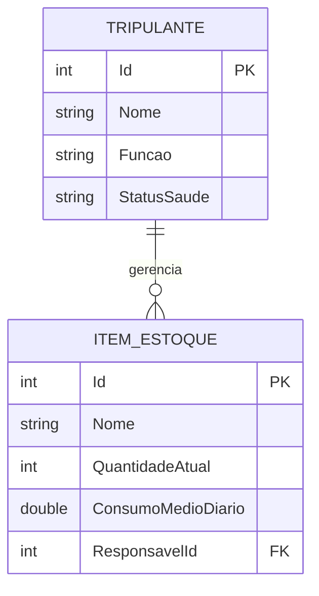

# 🚀 AstroColony - Supply & Crew Management API

## 👥 Integrantes
* Jonas Santos
* Gabriel Muller
* Pedro Ferreira

---

## 💡 Sobre o Projeto: Viabilidade, Inovação e Desenvolvimento
O **AstroColony** é uma API RESTful desenvolvida em .NET 8 (C#) projetada para resolver um problema crítico de logística: a gestão de suprimentos (supply chain) e o abastecimento contínuo de colônias isoladas no espaço. 

A grande inovação da nossa solução é aplicar a lógica preditiva de reposição de estoque. O sistema vai além do registro básico (CRUD) e possui inteligência para calcular a previsão de término dos itens com base no consumo médio diário. Isso permite que a API dispare alertas automáticos sobre o risco de ruptura de estoque antes que falte recurso vital para a tripulação, garantindo a viabilidade e segurança da missão.

Na parte técnica, seguimos rigorosamente as boas práticas de mercado e Clean Architecture, separando responsabilidades entre `Controllers`, `Entities` e `Data`. A persistência de dados utiliza banco relacional (Oracle DB) via Entity Framework Core com Migrations, garantindo a integridade do relacionamento 1:N, onde um Tripulante atua como o responsável técnico por diversos Itens de Estoque.

---

## 📊 Diagramas

### Diagrama de Entidade-Relacionamento (ERD)
O sistema possui um relacionamento de 1 para Muitos (1:N), mapeado via Entity Framework.

    🚀 Instruções de Execução e Acesso
Para rodar e testar o microsserviço localmente, siga o passo a passo:

Faça o clone deste repositório em sua máquina.

Abra o arquivo Program.cs e insira as suas credenciais de acesso ao Oracle na variável connectionString (campos User Id e Password).

Abra o terminal na pasta raiz do projeto e execute o comando dotnet restore para baixar as dependências.

Rode o comando dotnet ef database update para aplicar as Migrations e gerar a estrutura de tabelas no banco de dados.

Inicie a aplicação com o comando dotnet run.

Acesse a interface interativa de testes abrindo o link gerado no terminal seguido de /swagger (exemplo: http://localhost:5167/swagger).

🧪 Exemplos de Testes e Programação Defensiva
O sistema possui tratamento completo de erros e validação de regras de negócio. Valide os fluxos abaixo diretamente pelo Swagger UI:

Criação com Relacionamento (Status 201 Created): Na rota POST /api/Estoque, envie o payload abaixo para registrar um item e vinculá-lo ao tripulante de ID 1.
{
  "nome": "Ervilha enlatada",
  "quantidadeAtual": 7,
  "consumoMedioDiario": 0.5,
  "responsavelId": 1
}
Prevenção de Falha Matemática (Status 400 Bad Request): Na rota GET /api/Estoque/{id}/previsao-termino, se o item consultado possuir consumo diário igual a zero, a API intercepta o erro fatal de divisão por zero e retorna de forma tratada: "O consumo deve ser maior que zero."

Busca Inexistente (Status 404 Not Found): Na rota GET /api/Tripulantes/999, a tentativa de buscar ou deletar um registro com um ID ausente na base de dados não quebra a aplicação, retornando corretamente a mensagem: "Tripulante não encontrado."

Proteção de Integridade no Update (Status 400 Bad Request): Na rota PUT /api/Estoque/1, se o usuário tentar enviar no corpo da requisição um ID divergente do ID informado na URL da rota, a API bloqueia a alteração para evitar sobreposição de dados informando: "IDs não conferem."

🎬 Links das Apresentações
🎥 Vídeo Pitch (Viabilidade e Inovação - Máx 3 min): [COLE O LINK DO YOUTUBE AQUI]

💻 Vídeo Demonstração (Solução e Swagger - Máx 8 min): [COLE O LINK DO YOUTUBE AQUI]
